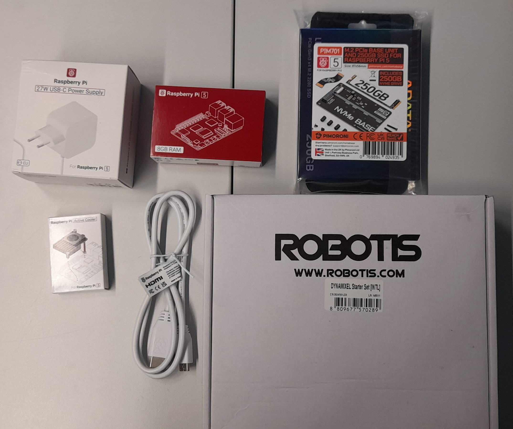

********************************************************************************
Notice de Montage d'une Raspberry Pi 5 pour le Contrôle de Moteurs Dynamixel 
********************************************************************************

Introduction
------------
Ce projet a pour objectif de créer un système de contrôle de moteurs Dynamixel à l'aide d'une Raspberry Pi 5. Les moteurs Dynamixel sont des actionneurs intelligents largement utilisés en robotique pour leur précision, leur flexibilité et leur facilité de communication. La Raspberry Pi 5, grâce à sa puissance de calcul et ses interfaces de communication, est un choix idéal pour piloter ces moteurs. Ce montage inclut également des composants supplémentaires pour optimiser les performances et la gestion de l'alimentation.

Liste des Composants
--------------------

Voici les composants nécessaires pour ce montage :

      Ensemble des composants nécessaires pour le montage

1. **Raspberry Pi 5** : Le cerveau du système, chargé de contrôler les moteurs Dynamixel.
2. **Raspberry Pi Active Cooler** : Un système de refroidissement actif pour maintenir la température de la Raspberry Pi 5.
3. **M.2 PCIe Base Unit et SSD 250 Go** : Pour le stockage et l'amélioration des performances du système.
4. **Alimentation 27W** : Une alimentation suffisamment puissante pour la Raspberry Pi 5 et les périphériques connectés.
5. **Starter Set Dynamixel** : Un ensemble de moteurs Dynamixel, un contrôleur et les câbles nécessaires.
6. **Câbles et connecteurs** : Pour relier les composants entre eux.
7. **Carte SD (optionnelle)** : Si vous n'utilisez pas le SSD pour le système d'exploitation.

Notice de Montage
-----------------

Étape 1 : Préparation de la Raspberry Pi 5
~~~~~~~~~~~~~~~~~~~~~~~~~~~~~~~~~~~~~~~~~~~

1. **Installez le SSD M.2** :

   - Insérez le SSD M.2 dans la base unit PCIe.

   .. figure:: resources/img/SSD_0.jpg
      :alt: Base unit PCIe avant installation du SSD M.2
      :width: 40%
      :align: center

      Base unit PCIe avant installation du SSD M.2

   .. figure:: resources/img/SSD_1.jpg
      :alt: Base unit PCIe avec SSD M.2
      :width: 40%
      :align: center
      
      Base unit PCIe avec SSD M.2
   
   - Connectez la base unit PCIe au port PCIe de la Raspberry Pi 5.

   .. caution:: Assurer vous que la nappe soit dans le bon sens avant de réaliser la connexion

   .. figure:: resources/img/PCIe_RPi5_attached.jpg
      :alt: PCIe et RPi5 liées
      :align: center
      :width: 40%

      Liasion de la base unit PCIe et de la Raspberry Pi 5

2. **Installez le Raspberry Pi Active Cooler** :

   - Fixez le dissipateur thermique sur le processeur de la Raspberry Pi 5.
   - Montez le ventilateur sur le dissipateur en suivant les instructions du fabricant.
   - Connectez le câble d'alimentation du ventilateur au port GPIO dédié sur la Raspberry Pi 5.

   .. figure:: resources/img/PCIe_RPi5_AirCooler.jpg
      :alt: Raspberry Pi Active Cooler
      :width: 40%
      :align: center

      Installation de la Raspberry Pi Active Cooler

3. **Installez le système d'exploitation** :

   - Si vous utilisez le SSD, installez le système d'exploitation (comme Raspberry Pi OS) sur le SSD via un autre ordinateur.
   - Si vous utilisez une carte SD, insérez-la dans le slot dédié de la Raspberry Pi 5.

Étape 2 : Connexion de l'Alimentation
~~~~~~~~~~~~~~~~~~~~~~~~~~~~~~~~~~~~~~
1. **Connectez l'alimentation 27W** :
   - Branchez l'alimentation 27W à la Raspberry Pi 5 via le port USB-C.
   - Assurez-vous que l'alimentation est suffisante pour alimenter la Raspberry Pi 5 et les périphériques connectés.

Étape 3 : Connexion des Moteurs Dynamixel
~~~~~~~~~~~~~~~~~~~~~~~~~~~~~~~~~~~~~~~~~~
1. **Préparez le Starter Set Dynamixel** :
   - Identifiez les moteurs Dynamixel, le contrôleur et les câbles fournis dans le kit.
   - Connectez les moteurs Dynamixel au contrôleur en utilisant les câbles fournis.

2. **Connectez le contrôleur Dynamixel à la Raspberry Pi 5** :
   - Utilisez un câble USB pour connecter le contrôleur Dynamixel à un port USB de la Raspberry Pi 5.
   - Assurez-vous que les connexions sont sécurisées.

Étape 4 : Configuration Logicielle
~~~~~~~~~~~~~~~~~~~~~~~~~~~~~~~~~~~
1. **Installez les pilotes et bibliothèques nécessaires** :
   - Installez les pilotes pour le contrôleur Dynamixel et les bibliothèques de contrôle des moteurs (comme Dynamixel SDK).
   - Configurez les paramètres de communication (baud rate, ID des moteurs, etc.) en suivant la documentation du fabricant.

2. **Testez le système** :
   - Écrivez un script simple en Python ou C++ pour contrôler les moteurs Dynamixel.
   - Vérifiez que les moteurs répondent correctement aux commandes.

Étape 5 : Finalisation
~~~~~~~~~~~~~~~~~~~~~~~
1. **Vérifiez toutes les connexions** :
   - Assurez-vous que tous les câbles sont bien connectés et que le système est stable.
2. **Testez le refroidissement** :
   - Lancez une charge de travail sur la Raspberry Pi 5 et vérifiez que le système de refroidissement fonctionne correctement.

Conclusion
----------
Ce montage vous permet de contrôler des moteurs Dynamixel avec une Raspberry Pi 5, en tirant parti de la puissance de calcul et des interfaces de communication de la carte. Avec ce système, vous pouvez développer des applications robotiques avancées, allant de la manipulation d'objets à la locomotion robotique. Assurez-vous de bien suivre les étapes de montage et de configuration pour garantir un fonctionnement optimal.

Remarque
--------
Consultez les documentations techniques des composants pour des instructions détaillées et des informations spécifiques.
