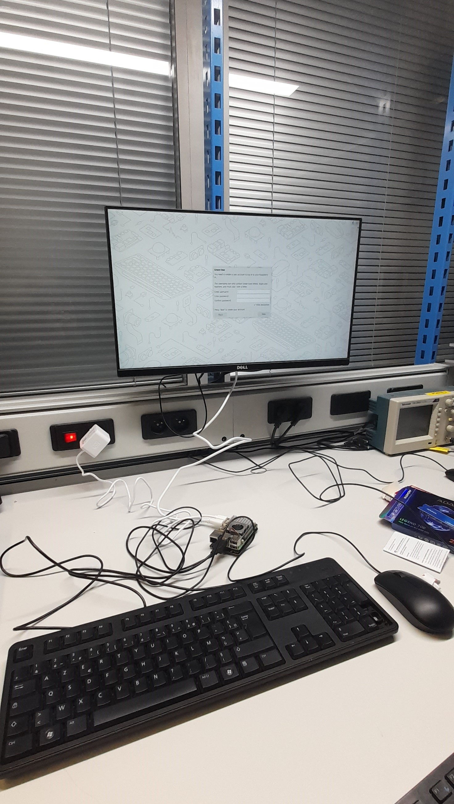

#####################################################
Prise en main du matériel 
#####################################################

Introduction
------------

Liste des Composants
--------------------

Voici les composants nécessaires pour ce montage :

.. figure:: resources/img/Starter_pack.jpg
      :alt: Starter_pack
      :width: 40%
      :align: center

      Ensemble des composants nécessaires pour le montage

1. `**Raspberry Pi 5**<https://datasheets.raspberrypi.com/rpi5/raspberry-pi-5-product-brief.pdf>`_ : Le cerveau du système, chargé de contrôler les moteurs Dynamixel.
2. `**Raspberry Pi Active Cooler**<https://datasheets.raspberrypi.com/cooling/raspberry-pi-active-cooler-product-brief.pdf>`_ : Un système de refroidissement actif pour maintenir la température de la Raspberry Pi 5.
3. `**M.2 PCIe Base Unit et SSD 250 Go**<https://www.adata.com/upload/downloadfile/Datasheet_SWORDFISH%20PCIe%20Gen3x4%20M.2%20SSD_EN_20201214.pdf>`_ : Pour le stockage et l'amélioration des performances du système.
4. **Alimentation 27W** : Une alimentation suffisamment puissante pour la Raspberry Pi 5 et les périphériques connectés.
5. `**Starter Set Dynamixel**<https://www.robotis.us/dynamixel-starter-set-us/>`_ : Un ensemble de moteurs Dynamixel, un contrôleur et les câbles nécessaires.
6. **Câbles et connecteurs** : Pour relier les composants entre eux.
7. **Carte SD (optionnelle)** : Pour remplacer la SSD pour le système d'exploitation si besoin.

Notice de Montage
-----------------

Étape 1 : Préparation de la Raspberry Pi 5
~~~~~~~~~~~~~~~~~~~~~~~~~~~~~~~~~~~~~~~~~~~

1. **Installez le SSD M.2** :

   - Insérez le SSD M.2 dans la base unit PCIe.

   .. figure:: resources/img/SSD_0.jpg
      :alt: Base unit PCIe avant installation du SSD M.2
      :width: 40%
      :align: center

      Base unit PCIe avant installation du SSD M.2

   .. figure:: resources/img/SSD_1.jpg
      :alt: Base unit PCIe avec SSD M.2
      :width: 40%
      :align: center
      
      Base unit PCIe avec SSD M.2
   
   - Connectez la base unit PCIe au port PCIe de la Raspberry Pi 5.

   .. caution:: Assurer vous que la nappe soit dans le bon sens avant de réaliser la connexion

   .. figure:: resources/img/PCIe_RPi5_attached.jpg
      :alt: PCIe et RPi5 liées
      :align: center
      :width: 40%

      Liasion de la base unit PCIe et de la Raspberry Pi 5

2. **Installez le Raspberry Pi Active Cooler** :

   - Fixez le dissipateur thermique sur le processeur de la Raspberry Pi 5.
   - Montez le ventilateur sur le dissipateur en suivant les instructions du fabricant.
   - Connectez le câble d'alimentation du ventilateur au port GPIO dédié sur la Raspberry Pi 5.

   .. figure:: resources/img/PCIe_RPi5_AirCooler.jpg
      :alt: Raspberry Pi Active Cooler
      :width: 40%
      :align: center

      Installation de la Raspberry Pi Active Cooler

3. **Installez le système d'exploitation** :

   - Si vous utilisez le SSD, installez le système d'exploitation (ici Ubuntu) sur le SSD via un autre ordinateur. Pour cela, vous pouvez suivre les instructions de la section :ref:`insallation_of_ubuntu`.
   - Si vous utilisez une carte SD, insérez-la dans le slot dédié de la Raspberry Pi 5.

4. **Installation de ROS2**

Suivez les instructions de la section :ref:`installation_of_ros2` pour installer ROS2 sur la Raspberry Pi 5.

Étape 2 : Connexion de l'Alimentation
~~~~~~~~~~~~~~~~~~~~~~~~~~~~~~~~~~~~~~
1. **Connectez l'alimentation 27W** :
   - Branchez l'alimentation 27W à la Raspberry Pi 5 via le port USB-C.

Voici à quoi devrait ressembler le système  dans son ensemble :

      RaspberryPi 5 installée et prête à l'utilisation

Étape 3 : Préparation des Moteurs Dynamixel
~~~~~~~~~~~~~~~~~~~~~~~~~~~~~~~~~~~~~~~~~~~~

Assurez-vous d'avoir les composants suivants :

1. **U2D2**
2. **U2D2 Power Hub Board**
3. **Plastic Rivets(for U2D2 attachment)**
4. **Nut M3** 	
5. **Support M3x10x6**
6. **SMPS 12V 5A AC Adapter**
7. **ROBOT Cable-X3P 100mm** 	
8. **ROBOT Cable-X4P 100mm**

1. **Montage du contrôleur U2D2 du Set Dynamixel** :

   - Installez les supports et les écrous fournis sur la breadboard. 
   - Fixez le contrôleur U2D2 sur la Raspberry Pi 5 à l'aide des rivets en plastique fournis.
   
2. **Connexion du contrôleur aux moteurs et à la Raspberry Pi 5** :

   - Connectez les moteurs Dynamixel au contrôleur en utilisant les câbles fournis.
   - Utilisez un câble USB pour connecter le contrôleur Dynamixel à un port USB de la Raspberry Pi 5.
   - Assurez-vous que les connexions sont sécurisées.

   .. figure:: resources/img/StarterPack_Setup_Dyna.png
      :alt: Montage du Starter Pack Dynamixel
      :scale: 50%
      :align: center

      Montage du Starter Pack Dynamixel
    
Pour plus d'informations sur le montage des moteurs Dynamixel, veuillez consulter la `page <https://robotis.co.uk/robotis-dynamixel-starter-set-intl.html>`_  de Robotis à ce sujet.
