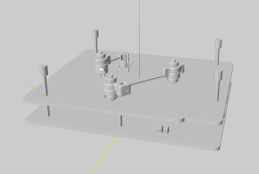
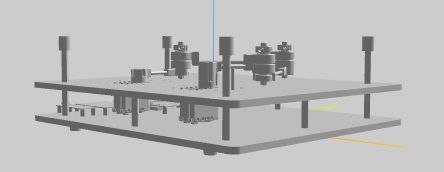

###################################################
 Génération de la description URDF du pantographe
###################################################

Nous allons utiliser le modèle 3D au format step conçu et réalisé par M. Olivier PICCIN pour générer la description URDF du pantographe.

.. figure:: resources/img/pantograph_step_model.png
   :align: center

Il s'agit d'un assemblage comportant 5 pièces principales :

  #. BATI_ASM: le bâti de la strucuture du pantographe avec les 2 moteurs pas à pas. Dans l'URDF nous allons le nommer ``base``.
  #. LINK1_ASM: le bras gauche du pantographe. Dans l'URDF nous allons le nommer ``link1``.
  #. LINK2_ASM: l'avant bras gauche du pantographe. Dans l'URDF nous allons le nommer ``link2``.
  #. LINK3_ASM: l'avant bras droit du pantographe. Dans l'URDF nous allons le nommer ``link3``.
  #. LINK4_ASM: le bras droit du pantographe. Dans l'URDF nous allons le nommer ``link4``.

:download:`maquette-5-barres_asm.stp <resources/cad/maquette-5-barres_asm.stp>`

==================================
Extraction des modèles 3D en step
==================================

Pour extraire les modèles 3D au format step, vous pouvez utiliser le logiciel freecad.
   
   #. :download:`base.stp <resources/cad/base.stp>`
   #. :download:`link1.stp <resources/cad/link1.stp>`
   #. :download:`link2.stp <resources/cad/link2.stp>`
   #. :download:`link3.stp <resources/cad/link3.stp>`
   #. :download:`link4.stp <resources/cad/link4.stp>`

=====================================
Conversion des modèles 3D en collada
=====================================

Il faut donc télécharger ses fichiers .dae pour modeliser la pentographe
   
   #. :download:`base.dae <resources/cad/base.dae>`
   #. :download:`link1.dae <resources/cad/link1.dae>`
   #. :download:`link2.dae <resources/cad/link2.dae>`
   #. :download:`link3.dae <resources/cad/link3.dae>`
   #. :download:`link4.dae <resources/cad/link4.dae>`

=========================
Clonage du dossier Scara
=========================

Il faut cloner le dossier scara sur le git du prof avec le lien suivant : 

.. code-block:: bash

   git clone https://github.com/yguel/scara_tutorial_ros2.git

Il faut maintenant modifier le fichier ``scara.urdf`` qui se trouve à l'emplacement ~/Scara_tuto_ros2/scara_description/urdf

.. code-block:: bash

   cd ~/Scara_tuto_ros2/scara_description/urdf

Il faut aussi remplacer le code du fichier ``scara.urdf`` par le code suivant : 

.. code-block:: bash

   <robot name="test_dae">
  <!-- Base fixe -->
  <link name="base">
    <visual>
      <geometry>
        <mesh filename="base.dae"/>
      </geometry>
      <origin xyz="0 0 0" rpy="1.57 0 0"/>
    </visual>
  </link>

   <robot name="test_dae">
  <!-- Base fixe -->
  <link name="base">
    <visual>
      <geometry>
        <mesh filename="base.dae"/>
      </geometry>
      <origin xyz="0 0 0" rpy="1.57 0 0"/>
    </visual>
  </link>

  <!-- Link 1 -->
  <link name="link1">
    <visual>
      <geometry>
        <mesh filename="link1.dae"/>
      </geometry>
      <origin xyz="0 0 0" rpy="1.57 0 0"/>
    </visual>
  </link>

  <!-- Revolute 1 -->
  <joint name="Revolute1" type="revolute">
    <parent link="base"/>
    <child link="link1"/>
    <origin xyz="0 0 0" rpy="0 0 0"/>
    <axis xyz="0 0 1"/>
  </joint>

  <!--  Link 2 -->
  <link name="link2">
    <visual>
      <geometry>
        <mesh filename="link2.dae"/>
      </geometry>
      <origin xyz="0 0 0" rpy="1.57 0 0"/>
    </visual>
  </link>

  <!-- Revolute 2 -->
  <joint name="Revolute2" type="revolute">
    <parent link="link1"/>
    <child link="link2"/>
    <origin xyz="0 0 0" rpy="0 0 0"/>
    
    <axis xyz="0 0 1"/>
  </joint>

  <!-- Link 3 -->
  <link name="link3">
    <visual>
      <geometry>
        <mesh filename="link3.dae"/>
      </geometry>
    
      <origin xyz="0 0 0" rpy="1.57 0 0"/>
    </visual>
  </link>

  <!-- Revolute 3 -->
  <joint name="Revolute3" type="revolute">
    <parent link="link2"/>
    <child link="link3"/>
    <origin xyz="0 0 0" rpy="0 0 0"/>
  
    <axis xyz="0 0 1"/>
  </joint>

  <!-- Link4 -->
  <link name="link4">
    <visual>
      <geometry>
        <mesh filename="link4.dae"/>
      </geometry>
       <material name = "green"/>
      <origin xyz="0 0 0" rpy="1.57 0 0"/>
    </visual>
  </link>

  <!-- Revolute 4 -->
  <joint name="Revolute4" type="revolute">
    <parent link="link3"/>
    <child link="link4"/>
    <origin xyz="0 0 0" rpy="0 0 0"/>

    <axis xyz="0 0 1"/>
  </joint>
  
  </robot>

Tous les fichiers .dae doivent etre dans le meme repertoire que le fichier scara.

=========================
Création du fichier URDF
=========================

Pour importer la géometrie de chaque composant, il faut utiliser la commande ``<mesh>``.

=========================
Résultats
=========================
Pour visualiser le modèle, il faut télécharger sur ``<VS Code>`` : Urdf visualiser :

Représentation mécanique du pantographe dans un fichier URDF.